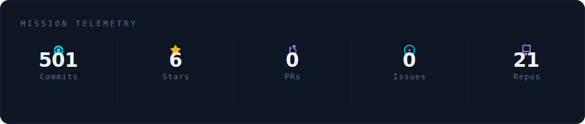

  

  
  
  
  

---

### 🌌 Mission Overview

  
| | |
| - | - |
| `Python` | اسکریپت‌نویسی برای استخراج داده از APIهای بزرگ |
| `APIs` | تخصص در TMDB، IGDB و معماری RESTful |
| `Automation` | ساخت پایشگرها و کرالرهای هوشمند با GitHub Actions |

---

### 📡 Telemetry & Systems

  

  

---

### ✨ Featured Constellations

  

---

### 🐍 Galaxy Serpent

<picture>
  <source media="(prefers-color-scheme: dark)" srcset="https://raw.githubusercontent.com/khashayardev/khashayardev/output/github-snake-dark.svg" />
  <source media="(prefers-color-scheme: light)" srcset="https://raw.githubusercontent.com/khashayardev/khashayardev/output/github-snake.svg" />
  
</picture>

  
  

---

  

---

### 🛸 Explore More

<table align="center">
  <tr>
    <td align="center" width="150">
      <a href="https://github.com/khashayardev/movie-database-scraper">
        <b>movie-database-scraper</b> 
        TMDB data scraper
      </a>
    </td>
    <td align="center" width="150">
      <a href="https://github.com/khashayardev/igdb-game-database-scraper">
        <b>igdb-game-scraper</b> 
        IGDB game scraper
      </a>
     </td>
    <td align="center" width="150">
      <a href="https://github.com/khashayardev/tmdb-poster-downloader">
        <b>tmdb-poster-downloader</b> 
        Bulk poster downloader
      </a>
     </td>
    <td align="center" width="150">
      <a href="https://github.com/khashayardev/github-models-ai-chatbot">
        <b>github-models-chatbot</b> 
        AI chatbot interface
      </a>
     </td>
  </table>
</table>

---

  

